# UML diagrams and workflow explanations

These Mermaid sources use type-before-name ER attributes (for example `uuid id PK`). Editable `.mmd` files are in `docs/diagrams/`. Render them in a Mermaid-compatible Markdown viewer or paste the source into a Mermaid renderer. They document the implementation, not a future enterprise cluster.

## Component architecture

The single backend owns orchestration. Kafka is used for document ingestion, while normal queries use bounded in-process workers. Redis accelerates reads but PostgreSQL stores authoritative workflow state.

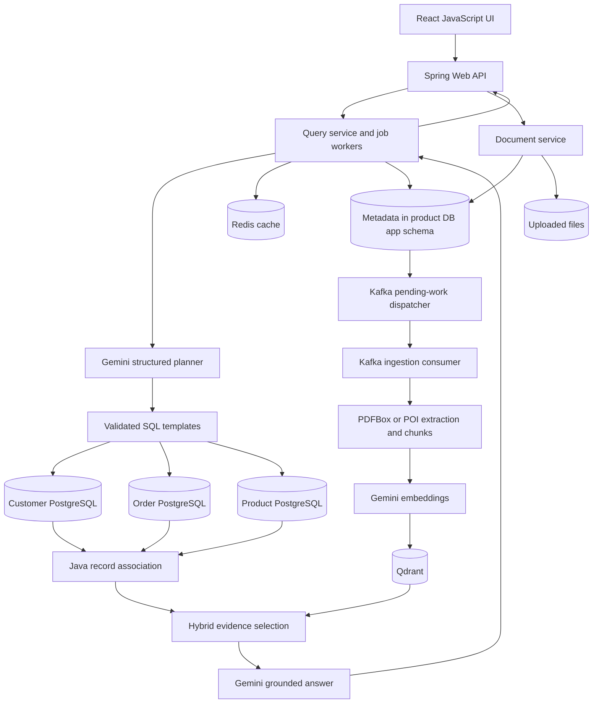
```mermaid
flowchart TB
 U[React JavaScript UI] --> API[Spring Web API]
 API --> Q[Query service and job workers]
 API --> D[Document service]
 Q --> P[Gemini structured planner]
 P --> S[Validated SQL templates]
 S --> C[(Customer PostgreSQL)]
 S --> O[(Order PostgreSQL)]
 S --> B[(Product PostgreSQL)]
 C --> J[Java record association]
 O --> J
 B --> J
 D --> M[(Metadata in product DB app schema)]
 D --> F[(Uploaded files)]
 M --> K[Kafka pending-work dispatcher]
 K --> L[Kafka ingestion consumer]
 L --> E[PDFBox or POI extraction and chunks]
 E --> A[Gemini embeddings]
 A --> V[(Qdrant)]
 J --> H[Hybrid evidence selection]
 V --> H
 H --> G[Gemini grounded answer]
 G --> Q
 Q --> R[(Redis cache)]
 Q --> M
 Q --> API
```

## Deployment

Three separate PostgreSQL containers model independent domain databases. React static assets are packaged in the Spring JAR; Gemini is an external HTTPS dependency. All published local ports bind to loopback.

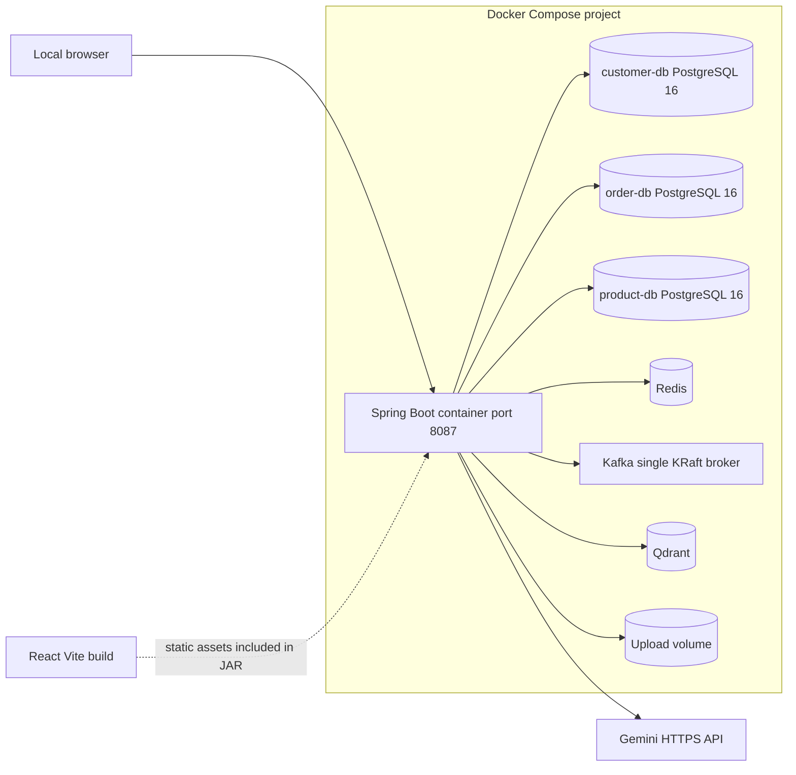
```mermaid
flowchart LR
 Browser[Local browser] --> App[Spring Boot container port 8087]
 subgraph Docker[Docker Compose project]
 App --> Customer[(customer-db PostgreSQL 16)]
 App --> Orders[(order-db PostgreSQL 16)]
 App --> Products[(product-db PostgreSQL 16)]
 App --> Redis[(Redis)]
 App --> Kafka[Kafka single KRaft broker]
 App --> Qdrant[(Qdrant)]
 App --> Files[(Upload volume)]
 end
 App --> Gemini[Gemini HTTPS API]
 Build[React Vite build] -. static assets included in JAR .-> App
```

## UML use cases

The human actor can ask, inspect evidence, upload, retry and download. The developer operates configuration and tests. These are capability relationships, not a sequence of execution.

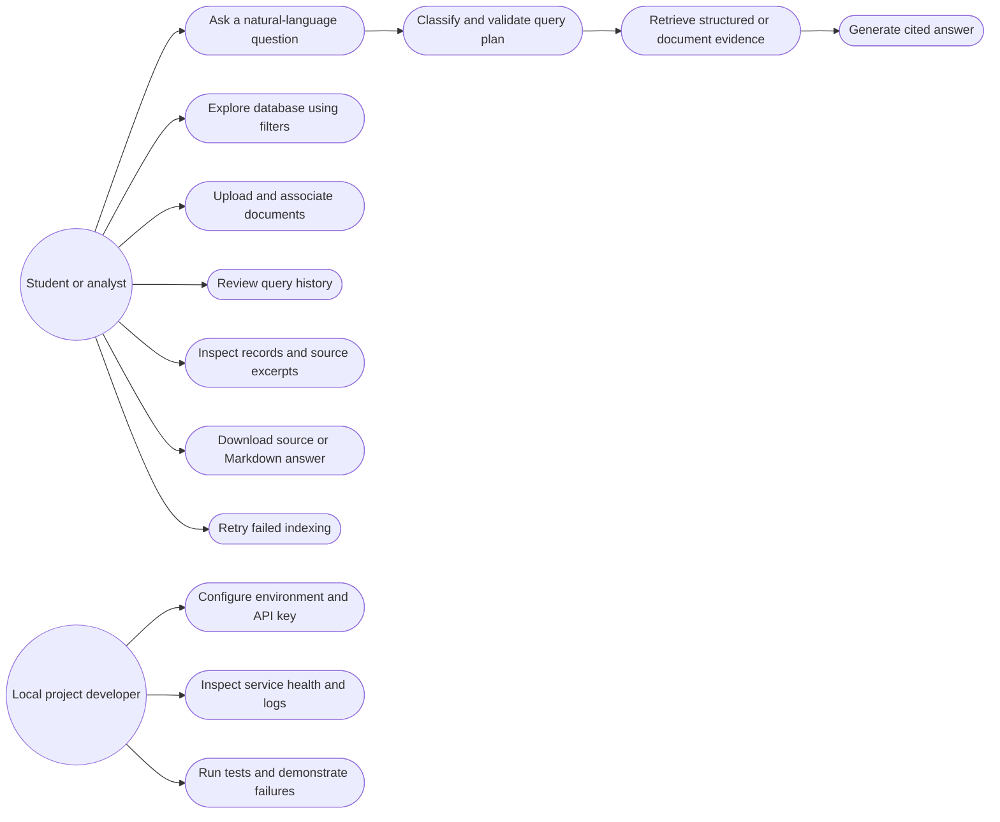
```mermaid
flowchart LR
 User((Student or analyst)) --> Ask([Ask a natural-language question])
 User --> Guided([Explore database using filters])
 User --> Upload([Upload and associate documents])
 User --> History([Review query history])
 User --> Evidence([Inspect records and source excerpts])
 User --> Download([Download source or Markdown answer])
 User --> Retry([Retry failed indexing])
 Ask --> Plan([Classify and validate query plan])
 Plan --> Retrieve([Retrieve structured or document evidence])
 Retrieve --> Answer([Generate cited answer])
 Admin((Local project developer)) --> Config([Configure environment and API key])
 Admin --> Health([Inspect service health and logs])
 Admin --> Tests([Run tests and demonstrate failures])
```

## UML classes

QueryService coordinates typed plans and evidence. SqlEngine and ShardManager isolate database execution. DocumentService connects extraction, Kafka and vector persistence. Entities store durable state.

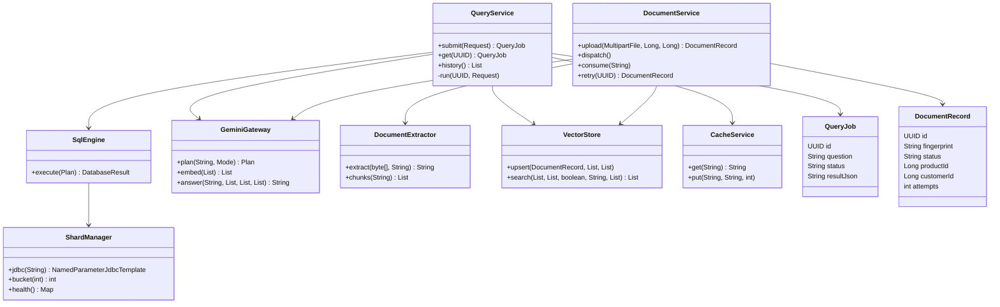
```mermaid
classDiagram
 class QueryService {
  +submit(Request) QueryJob
  +get(UUID) QueryJob
  +history() List
  -run(UUID, Request)
 }
 class SqlEngine {
  +execute(Plan) DatabaseResult
 }
 class ShardManager {
  +jdbc(String) NamedParameterJdbcTemplate
  +bucket(int) int
  +health() Map
 }
 class GeminiGateway {
  +plan(String, Mode) Plan
  +embed(List) List
  +answer(String, List, List, List) String
 }
 class DocumentService {
  +upload(MultipartFile, Long, Long) DocumentRecord
  +dispatch()
  +consume(String)
  +retry(UUID) DocumentRecord
 }
 class DocumentExtractor {
  +extract(byte[], String) String
  +chunks(String) List
 }
 class VectorStore {
  +upsert(DocumentRecord, List, List)
  +search(List, List, boolean, String, List) List
 }
 class CacheService {
  +get(String) String
  +put(String, String, int)
 }
 class QueryJob {
  UUID id
  String question
  String status
  String resultJson
 }
 class DocumentRecord {
  UUID id
  String fingerprint
  String status
  Long productId
  Long customerId
  int attempts
 }
 QueryService --> SqlEngine
 SqlEngine --> ShardManager
 QueryService --> GeminiGateway
 QueryService --> VectorStore
 QueryService --> CacheService
 QueryService --> QueryJob
 DocumentService --> DocumentRecord
 DocumentService --> DocumentExtractor
 DocumentService --> GeminiGateway
 DocumentService --> VectorStore
```

## Database ER model

Solid relationships are local foreign keys. Dotted relationships cross databases and are associated in Java, not enforced remotely. Composite partition keys include bucket. Documents and query jobs live in the app schema.

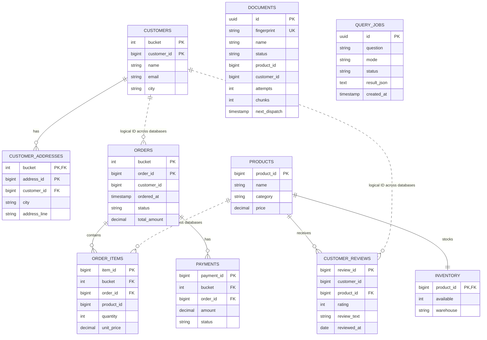
```mermaid
erDiagram
 CUSTOMERS ||--o{ CUSTOMER_ADDRESSES : has
 CUSTOMERS ||..o{ ORDERS : "logical ID across databases"
 ORDERS ||--o{ ORDER_ITEMS : contains
 ORDERS ||--o{ PAYMENTS : has
 PRODUCTS ||--|| INVENTORY : stocks
 PRODUCTS ||--o{ CUSTOMER_REVIEWS : receives
 PRODUCTS ||..o{ ORDER_ITEMS : "logical ID across databases"
 CUSTOMERS ||..o{ CUSTOMER_REVIEWS : "logical ID across databases"
 CUSTOMERS {
  int bucket PK
  bigint customer_id PK
  string name
  string email
  string city
 }
 CUSTOMER_ADDRESSES {
  int bucket PK,FK
  bigint address_id PK
  bigint customer_id FK
  string city
  string address_line
 }
 ORDERS {
  int bucket PK
  bigint order_id PK
  bigint customer_id
  timestamp ordered_at
  string status
  decimal total_amount
 }
 ORDER_ITEMS {
  bigint item_id PK
  int bucket FK
  bigint order_id FK
  bigint product_id
  int quantity
  decimal unit_price
 }
 PAYMENTS {
  bigint payment_id PK
  int bucket FK
  bigint order_id FK
  decimal amount
  string status
 }
 PRODUCTS {
  bigint product_id PK
  string name
  string category
  decimal price
 }
 INVENTORY {
  bigint product_id PK,FK
  int available
  string warehouse
 }
 CUSTOMER_REVIEWS {
  bigint review_id PK
  bigint customer_id
  bigint product_id FK
  int rating
  string review_text
  date reviewed_at
 }
 DOCUMENTS {
  uuid id PK
  string fingerprint UK
  string name
  string status
  bigint product_id
  bigint customer_id
  int attempts
  int chunks
  timestamp next_dispatch
 }
 QUERY_JOBS {
  uuid id PK
  string question
  string mode
  string status
  text result_json
  timestamp created_at
 }
```

## Query sequence

A 202 response acknowledges scheduling only. The UI polls until durable completion. This diagram illustrates a cache miss using AI; guided SQL bypasses AI planning and synthesis. RAG-only queries bypass SQL.

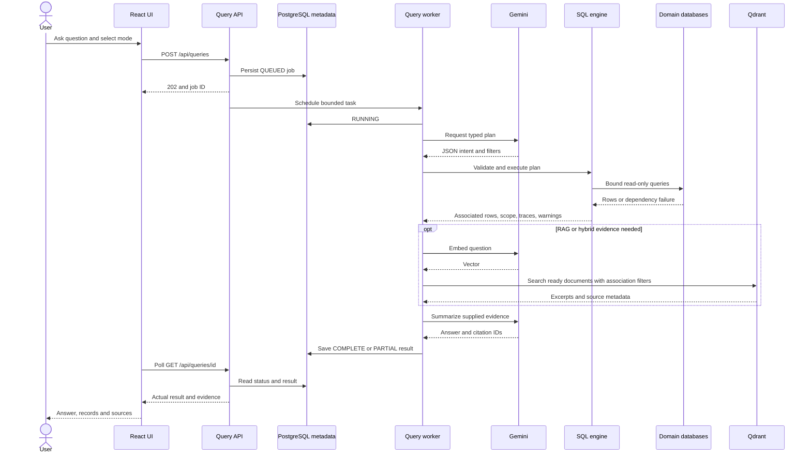
```mermaid
sequenceDiagram
 actor User
 participant UI as React UI
 participant API as Query API
 participant Jobs as PostgreSQL metadata
 participant Worker as Query worker
 participant AI as Gemini
 participant SQL as SQL engine
 participant Shards as Domain databases
 participant Vector as Qdrant
 User->>UI: Ask question and select mode
 UI->>API: POST /api/queries
 API->>Jobs: Persist QUEUED job
 API-->>UI: 202 and job ID
 API->>Worker: Schedule bounded task
 Worker->>Jobs: RUNNING
 Worker->>AI: Request typed plan
 AI-->>Worker: JSON intent and filters
 Worker->>SQL: Validate and execute plan
 SQL->>Shards: Bound read-only queries
 Shards-->>SQL: Rows or dependency failure
 SQL-->>Worker: Associated rows, scope, traces, warnings
 opt RAG or hybrid evidence needed
 Worker->>AI: Embed question
 AI-->>Worker: Vector
 Worker->>Vector: Search ready documents with association filters
 Vector-->>Worker: Excerpts and source metadata
 end
 Worker->>AI: Summarize supplied evidence
 AI-->>Worker: Answer and citation IDs
 Worker->>Jobs: Save COMPLETE or PARTIAL result
 UI->>API: Poll GET /api/queries/id
 API->>Jobs: Read status and result
 API-->>UI: Actual result and evidence
 UI-->>User: Answer, records and sources
```

## Document sequence

Upload saves a file and pending metadata before asynchronous publication. The consumer uses deterministic chunk IDs. With no key, the file instead remains WAITING_FOR_KEY. Duplicate fingerprint uploads reuse the existing record.

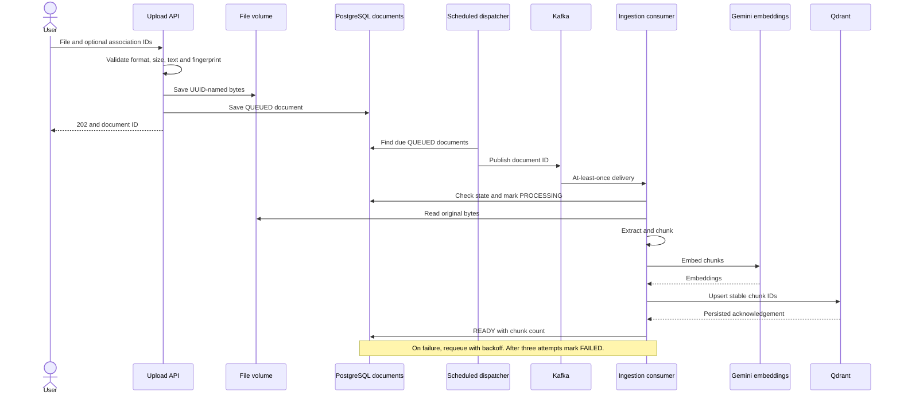
```mermaid
sequenceDiagram
 actor User
 participant API as Upload API
 participant Files as File volume
 participant DB as PostgreSQL documents
 participant Dispatch as Scheduled dispatcher
 participant Kafka
 participant Consumer as Ingestion consumer
 participant AI as Gemini embeddings
 participant Vector as Qdrant
 User->>API: File and optional association IDs
 API->>API: Validate format, size, text and fingerprint
 API->>Files: Save UUID-named bytes
 API->>DB: Save QUEUED document
 API-->>User: 202 and document ID
 Dispatch->>DB: Find due QUEUED documents
 Dispatch->>Kafka: Publish document ID
 Kafka->>Consumer: At-least-once delivery
 Consumer->>DB: Check state and mark PROCESSING
 Consumer->>Files: Read original bytes
 Consumer->>Consumer: Extract and chunk
 Consumer->>AI: Embed chunks
 AI-->>Consumer: Embeddings
 Consumer->>Vector: Upsert stable chunk IDs
 Vector-->>Consumer: Persisted acknowledgement
 Consumer->>DB: READY with chunk count
 Note over Consumer,DB: On failure, requeue with backoff. After three attempts mark FAILED.
```

## Query activity

Branching depends on mode and evidence availability. Empty SQL associations never justify searching unrelated documents. Warnings propagate into PARTIAL status and prevent new answer caching.

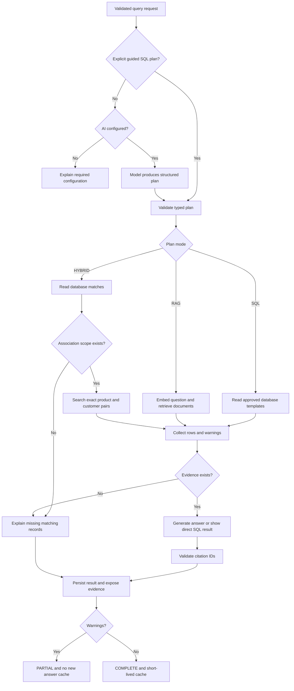
```mermaid
flowchart TD
 A[Validated query request] --> B{Explicit guided SQL plan?}
 B -- Yes --> C[Validate typed plan]
 B -- No --> D{AI configured?}
 D -- No --> E[Explain required configuration]
 D -- Yes --> F[Model produces structured plan]
 F --> C
 C --> G{Plan mode}
 G -- SQL --> S[Read approved database templates]
 G -- RAG --> R[Embed question and retrieve documents]
 G -- HYBRID --> H[Read database matches]
 H --> I{Association scope exists?}
 I -- No --> N[Explain missing matching records]
 I -- Yes --> R2[Search exact product and customer pairs]
 S --> J[Collect rows and warnings]
 R --> J
 R2 --> J
 J --> K{Evidence exists?}
 K -- No --> N
 K -- Yes --> L[Generate answer or show direct SQL result]
 L --> M[Validate citation IDs]
 M --> O[Persist result and expose evidence]
 N --> O
 O --> P{Warnings?}
 P -- Yes --> Q[PARTIAL and no new answer cache]
 P -- No --> T[COMPLETE and short-lived cache]
```

## Document lifecycle

Processing attempts are bounded to three. Explicit retry resets the attempt counter. Kafka publication can retry independently while a document remains QUEUED. READY means stored vectors exist, not that an AI claim has been verified.

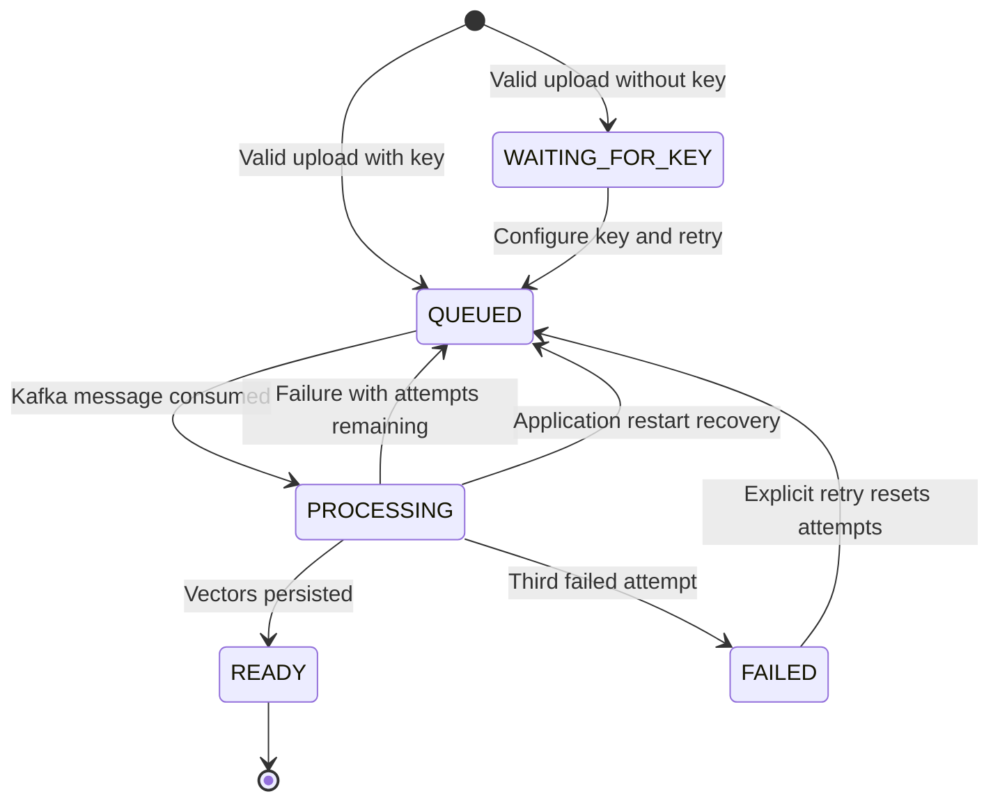
```mermaid
stateDiagram-v2
 [*] --> WAITING_FOR_KEY: Valid upload without key
 [*] --> QUEUED: Valid upload with key
 WAITING_FOR_KEY --> QUEUED: Configure key and retry
 QUEUED --> PROCESSING: Kafka message consumed
 PROCESSING --> READY: Vectors persisted
 PROCESSING --> QUEUED: Failure with attempts remaining
 PROCESSING --> FAILED: Third failed attempt
 PROCESSING --> QUEUED: Application restart recovery
 FAILED --> QUEUED: Explicit retry resets attempts
 READY --> [*]
```

## Domain plus hash routing

The product domain is selected by table ownership. The customer hash selects a local bucket within customer/order databases. The final join remains an application operation with no distributed snapshot guarantee.

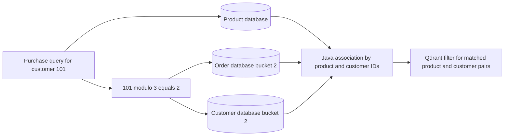
```mermaid
flowchart LR
 Q[Purchase query for customer 101] --> Product[(Product database)]
 Q --> Hash[101 modulo 3 equals 2]
 Hash --> Order[(Order database bucket 2)]
 Hash --> Customer[(Customer database bucket 2)]
 Product --> Join[Java association by product and customer IDs]
 Order --> Join
 Customer --> Join
 Join --> Evidence[Qdrant filter for matched product and customer pairs]
```

## 10. Account and personal data entity relationships

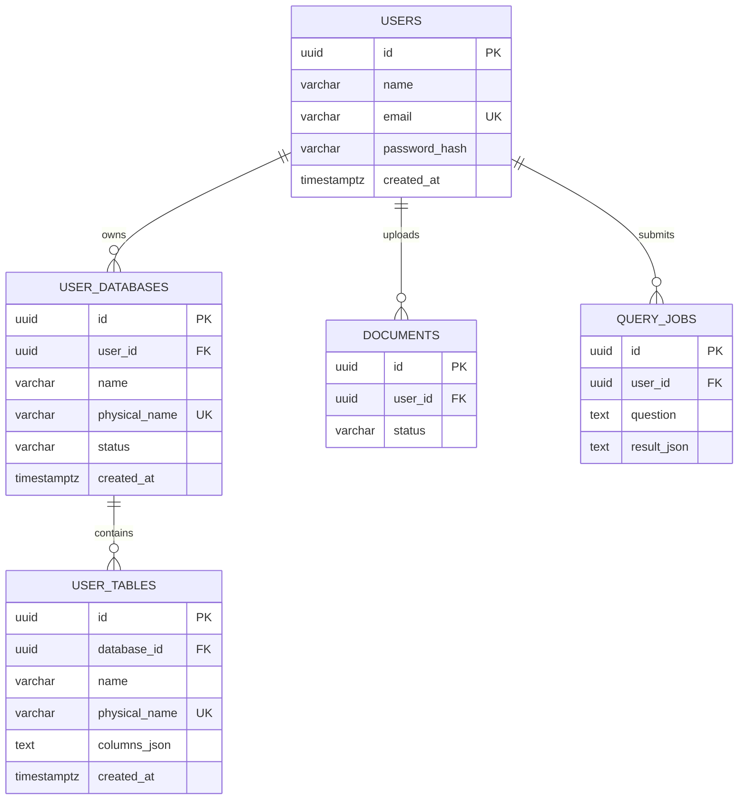
```mermaid
erDiagram
    USERS ||--o{ USER_DATABASES : owns
    USERS ||--o{ DOCUMENTS : uploads
    USERS ||--o{ QUERY_JOBS : submits
    USER_DATABASES ||--o{ USER_TABLES : contains
    USERS {
        uuid id PK
        varchar name
        varchar email UK
        varchar password_hash
        timestamptz created_at
    }
    USER_DATABASES {
        uuid id PK
        uuid user_id FK
        varchar name
        varchar physical_name UK
        varchar status
        timestamptz created_at
    }
    USER_TABLES {
        uuid id PK
        uuid database_id FK
        varchar name
        varchar physical_name UK
        text columns_json
        timestamptz created_at
    }
    DOCUMENTS {
        uuid id PK
        uuid user_id FK
        varchar status
    }
    QUERY_JOBS {
        uuid id PK
        uuid user_id FK
        text question
        text result_json
    }
```

These are metadata tables in the `app` schema. Legacy documents/jobs may have no owner and stay hidden. `physical_name` points to an actual PostgreSQL database/table; user-defined columns and records live there, not in a JSON blob masquerading as a relational table. Database/table names are unique within their owner/database respectively.

## 11. Authentication sequence

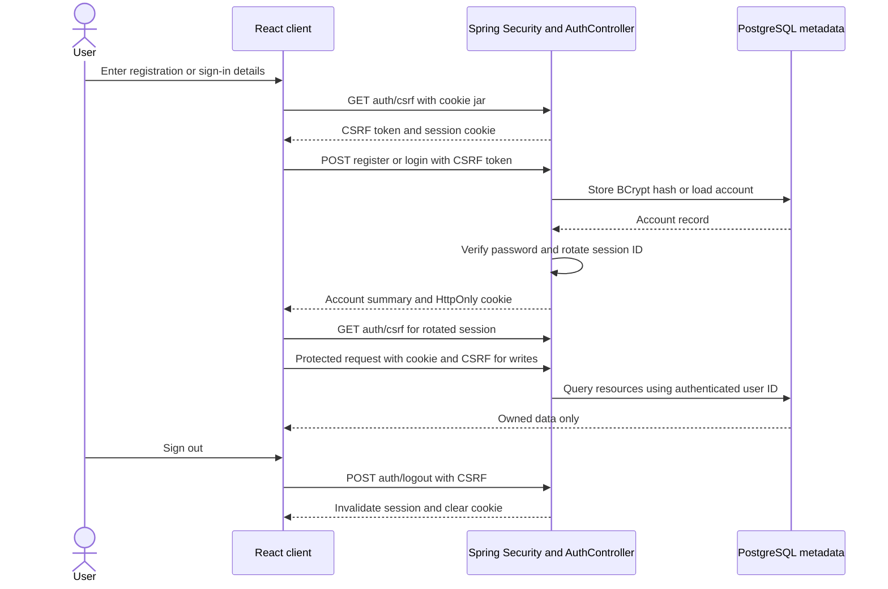
```mermaid
sequenceDiagram
    actor User
    participant UI as React client
    participant Auth as Spring Security and AuthController
    participant PG as PostgreSQL metadata
    User->>UI: Enter registration or sign-in details
    UI->>Auth: GET auth/csrf with cookie jar
    Auth-->>UI: CSRF token and session cookie
    UI->>Auth: POST register or login with CSRF token
    Auth->>PG: Store BCrypt hash or load account
    PG-->>Auth: Account record
    Auth->>Auth: Verify password and rotate session ID
    Auth-->>UI: Account summary and HttpOnly cookie
    UI->>Auth: GET auth/csrf for rotated session
    UI->>Auth: Protected request with cookie and CSRF for writes
    Auth->>PG: Query resources using authenticated user ID
    PG-->>UI: Owned data only
    User->>UI: Sign out
    UI->>Auth: POST auth/logout with CSRF
    Auth-->>UI: Invalidate session and clear cookie
```

The browser cannot choose a different owner by submitting a user ID. The authenticated principal supplies ownership. The client never stores a password hash or session token in localStorage.

## 12. Create database, table and record workflow

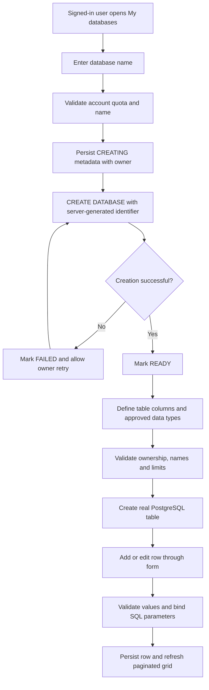
```mermaid
flowchart TD
    A[Signed-in user opens My databases] --> B[Enter database name]
    B --> C[Validate account quota and name]
    C --> D[Persist CREATING metadata with owner]
    D --> E[CREATE DATABASE with server-generated identifier]
    E --> F{Creation successful?}
    F -->|No| G[Mark FAILED and allow owner retry]
    G --> E
    F -->|Yes| H[Mark READY]
    H --> I[Define table columns and approved data types]
    I --> J[Validate ownership, names and limits]
    J --> K[Create real PostgreSQL table]
    K --> L[Add or edit row through form]
    L --> M[Validate values and bind SQL parameters]
    M --> N[Persist row and refresh paginated grid]
```

Database creation is outside a SQL transaction, with retryable metadata status. Table DDL and metadata span different databases; a crash between them needs administrator reconciliation. The editor intentionally has no raw SQL, drop-table or drop-database operation.

## 13. Personal table query sequence

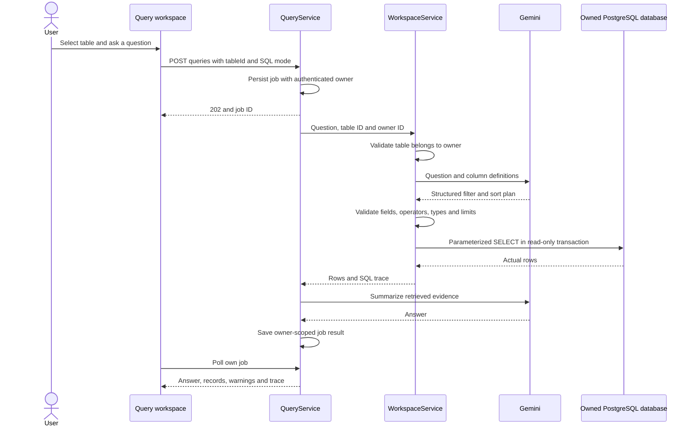
```mermaid
sequenceDiagram
    actor User
    participant UI as Query workspace
    participant API as QueryService
    participant WS as WorkspaceService
    participant AI as Gemini
    participant DB as Owned PostgreSQL database
    User->>UI: Select table and ask a question
    UI->>API: POST queries with tableId and SQL mode
    API->>API: Persist job with authenticated owner
    API-->>UI: 202 and job ID
    API->>WS: Question, table ID and owner ID
    WS->>WS: Validate table belongs to owner
    WS->>AI: Question and column definitions
    AI-->>WS: Structured filter and sort plan
    WS->>WS: Validate fields, operators, types and limits
    WS->>DB: Parameterized SELECT in read-only transaction
    DB-->>WS: Actual rows
    WS-->>API: Rows and SQL trace
    API->>AI: Summarize retrieved evidence
    AI-->>API: Answer
    API->>API: Save owner-scoped job result
    UI->>API: Poll own job
    API-->>UI: Answer, records, warnings and trace
```

Personal table queries bypass the result cache. They do not combine private tables with shared sample-shard data. Schema, question and returned evidence are sent to the configured Gemini API; its response is validated and never executed as free-form SQL.

## Automatic personal-database query routing

The default source discovers only the signed-in account's schemas. The planner selects a bounded typed plan; the backend validates all table and column references before any read. Two related tables can live in separate personal PostgreSQL databases. The Java engine performs an inner equality join, then filtering, sorting and a final limit. It does not imply a distributed transaction or execute model-written SQL.

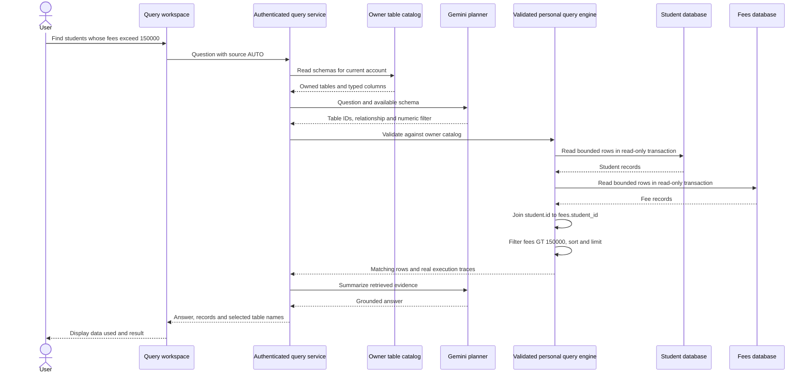
```mermaid
sequenceDiagram
    actor User
    participant UI as Query workspace
    participant API as Authenticated query service
    participant Catalog as Owner table catalog
    participant AI as Gemini planner
    participant Engine as Validated personal query engine
    participant Students as Student database
    participant Fees as Fees database
    User->>UI: Find students whose fees exceed 150000
    UI->>API: Question with source AUTO
    API->>Catalog: Read schemas for current account
    Catalog-->>API: Owned tables and typed columns
    API->>AI: Question and available schema
    AI-->>API: Table IDs, relationship and numeric filter
    API->>Engine: Validate against owner catalog
    Engine->>Students: Read bounded rows in read-only transaction
    Students-->>Engine: Student records
    Engine->>Fees: Read bounded rows in read-only transaction
    Fees-->>Engine: Fee records
    Engine->>Engine: Join student.id to fees.student_id
    Engine->>Engine: Filter fees GT 150000, sort and limit
    Engine-->>API: Matching rows and real execution traces
    API->>AI: Summarize retrieved evidence
    AI-->>API: Grounded answer
    API-->>UI: Answer, records and selected table names
    UI-->>User: Display data used and result
```

For the student-fees example, the fee row's own ID is distinct from its student ID. The explicit relationship uses `student.id = student_fees.student_id`; fees equal to 150000 are excluded by the strict greater-than filter. Missing relationships, unsupported plans, other-account tables and unavailable databases fail explicitly.

## Database editing and deletion

Local sources expose management actions after ownership and CSRF validation. Destructive actions require explicit confirmation in a dialog naming the selected object; the API validates that name against the current item. External sources expose read, schema refresh and disconnect; disconnect affects only local metadata.

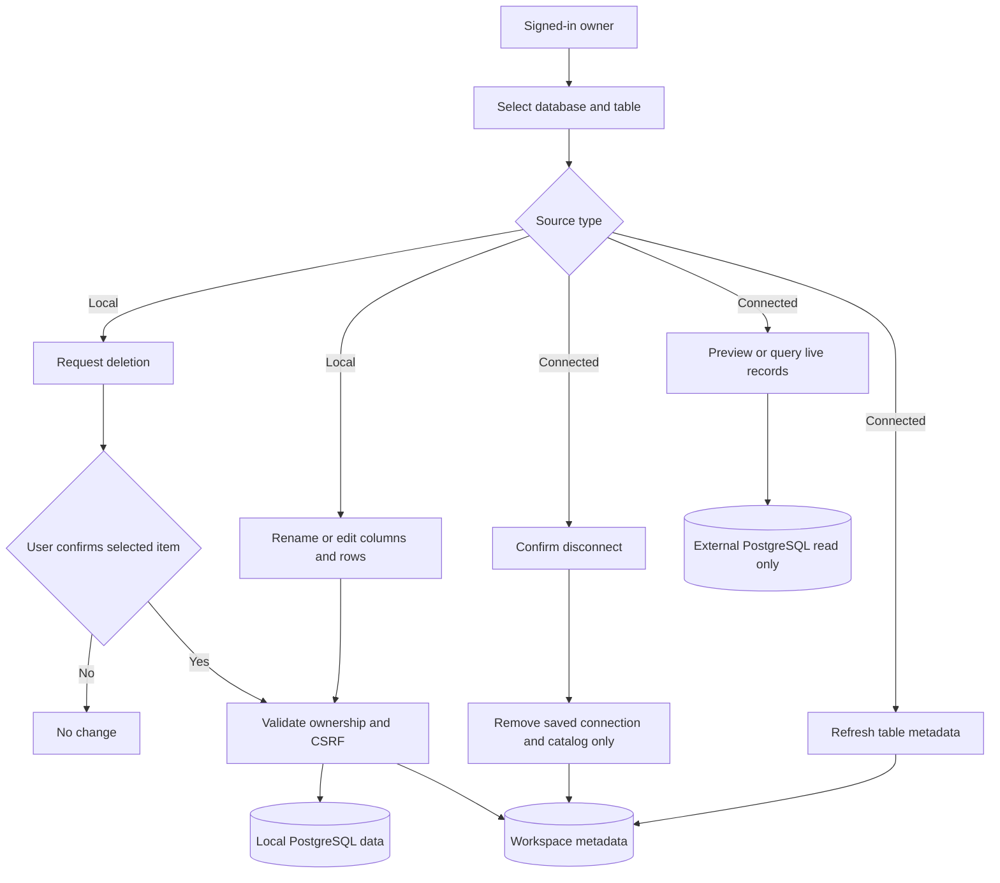
```mermaid
flowchart TD
    User[Signed-in owner] --> Select[Select database and table]
    Select --> Kind{Source type}
    Kind -->|Local| Edit[Rename or edit columns and rows]
    Kind -->|Local| Delete[Request deletion]
    Delete --> Confirm{User confirms selected item}
    Confirm -->|No| Cancel[No change]
    Confirm -->|Yes| Guard[Validate ownership and CSRF]
    Edit --> Guard
    Guard --> Local[(Local PostgreSQL data)]
    Guard --> Metadata[(Workspace metadata)]
    Kind -->|Connected| Read[Preview or query live records]
    Kind -->|Connected| Refresh[Refresh table metadata]
    Kind -->|Connected| Disconnect[Confirm disconnect]
    Disconnect --> Forget[Remove saved connection and catalog only]
    Forget --> Metadata
    Refresh --> Metadata
    Read --> External[(External PostgreSQL read only)]
```

## External PostgreSQL connection and query sequence

A link is parsed and host-checked, then tested before it is encrypted and saved. Only schema metadata and matching records reach Gemini. Connections are read-only and a failed update preserves the existing configuration.

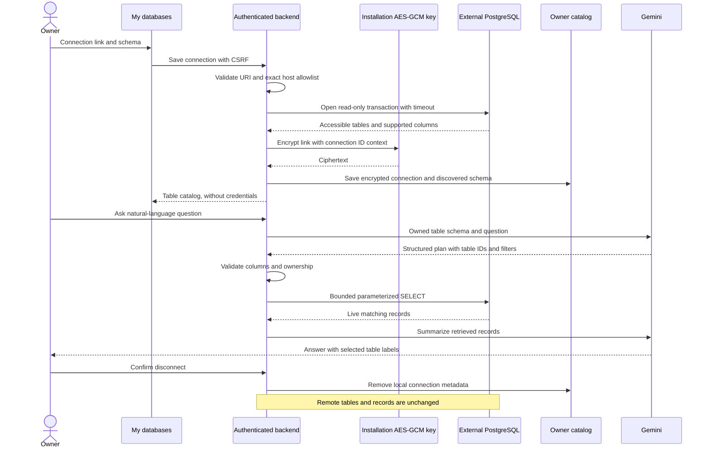
```mermaid
sequenceDiagram
    actor Owner
    participant UI as My databases
    participant API as Authenticated backend
    participant Vault as Installation AES-GCM key
    participant DB as External PostgreSQL
    participant Meta as Owner catalog
    participant AI as Gemini
    Owner->>UI: Connection link and schema
    UI->>API: Save connection with CSRF
    API->>API: Validate URI and exact host allowlist
    API->>DB: Open read-only transaction with timeout
    DB-->>API: Accessible tables and supported columns
    API->>Vault: Encrypt link with connection ID context
    Vault-->>API: Ciphertext
    API->>Meta: Save encrypted connection and discovered schema
    API-->>UI: Table catalog, without credentials
    Owner->>API: Ask natural-language question
    API->>AI: Owned table schema and question
    AI-->>API: Structured plan with table IDs and filters
    API->>API: Validate columns and ownership
    API->>DB: Bounded parameterized SELECT
    DB-->>API: Live matching records
    API->>AI: Summarize retrieved records
    AI-->>Owner: Answer with selected table labels
    Owner->>API: Confirm disconnect
    API->>Meta: Remove local connection metadata
    Note over API,DB: Remote tables and records are unchanged
```
